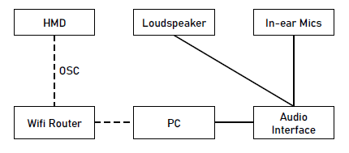

## Background
This project was initially developed during the COVID-19 pandemic, when the research facilities of AudioLab (University of York) could not be accessed for the purpose of individual HRTF measurements. Therefore a system for capturing sparse HRTF sets at home environment using a minimal hardware configuration was developed as a tool to further advance research into perceptual evaluation methods for spatial audio. The project together with a paper describing the system is to be presented at the 4th International Conference on Audio for Virtual and Augmented Reality in Redmond, WA  on August 15-17, 2022.


## How Does it Work
Thanks to the visual 3D cues displayed by a mixed-reality headset, the subject positions their head in relation to the single loudspeaker following a predefined list of measurement points. During this automated procedure, Head Related Impulse Responses (HRIRs) are captured at different sound incidence angles. The post-processing of the measured responses is aimed at eliminating the acoustic characteristic of the room where the measurement was taken.

## Demo Video


## System Architecture


## Getting Started: Hardware
Equpiment list:
* XR headset
* Loudspeaker
* In-ear Microphones
* PC with Audio Interface
* Wifi Router

Currently the only supported headset is Quest 2.

The system was mainly tested with a custom 3D printed loudspeaker, however, it should work fine with any decent audio source.

The process requires a pair of in-ear microphones inserted into ear canals.

Any Windows, Mac or Linux PC should work. The systems was tested with RME Fireface USB interface.


## Getting Started: Software
More information on each of the software components of the system can be found in the following repositories:
* [XR Interface](https://github.com/trsonic/XR-HRTF-Q2/): A mixed-reality app developed in Unity using Oculus SDK. The app is used for head orientation and position control.
* [Measurement Control App](https://github.com/trsonic/XR-HRTF-capture/): A C++ app used for sweep signal playback, recording and measurement control.
* [Postprocessing Scripts](https://github.com/trsonic/XR-HRTF-processing/): A set of Matlab scripts to process captured sweeps.


## Contributing
We would like to encourage other researchers to use the system and participate in its further development. Please contact us if you have any ideas and suggestions how this tool could be improved.

## Authors
* Tomasz Rudzki, email: <tr837@york.ac.uk>

## License
GNU General Public License v3.0

## Acknowledgments
* 

## Citation
```
@inproceedings{rudzki2022xr,
  title={XR-based HRTF Measurements},
  author={Rudzki, Tomasz and Murphy, Damian and Kearney, Gavin},
  booktitle={Audio Engineering Society Conference: 2022 AES International Conference on Audio for Virtual and Augmented Reality},
  year={2022},
  organization={Audio Engineering Society}
}
```

## Safety Note
Remain cautious when playing back sweep sine signals through measurement loudspeaker or headphones. Always wear hearing protection. In order to minimize the exposure of the subject to test signals, only blocked ear canal measurements are recommended. Anyway, please be careful at all times!!! This is an experimental tool which is in its early stage of development and may contain bugs.
